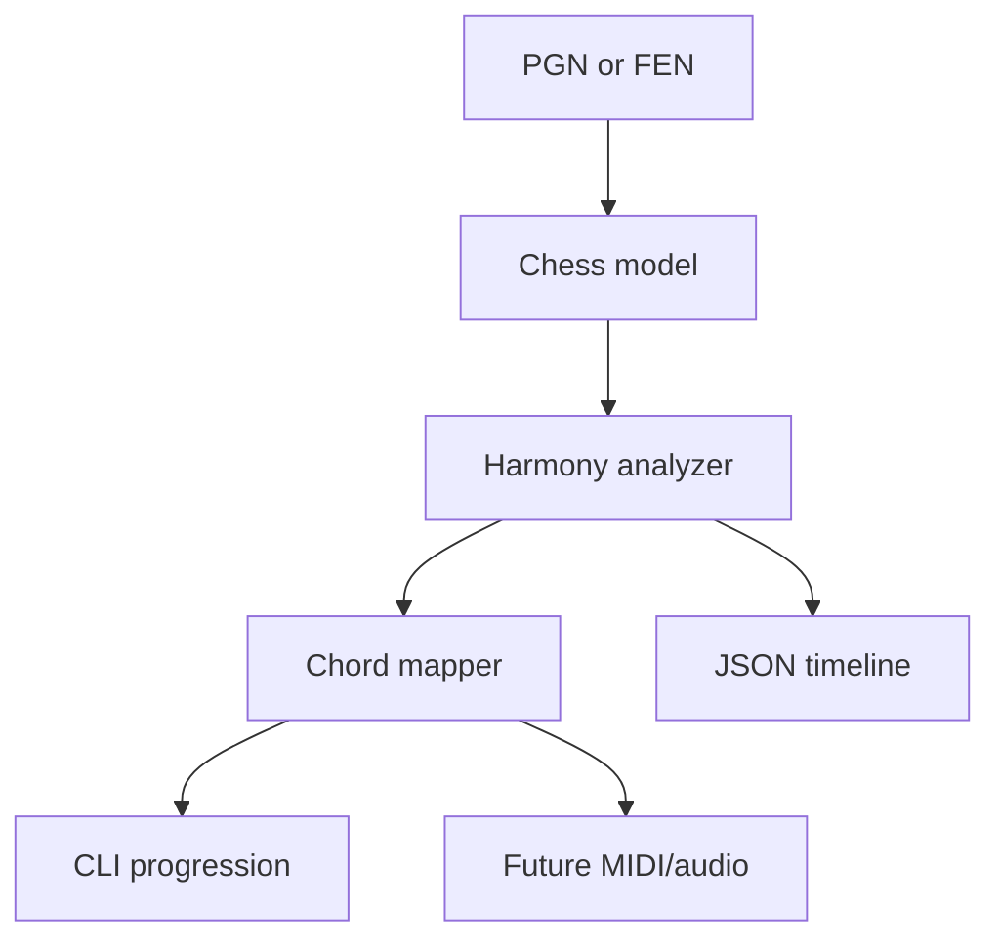

# Piano Man

**What if a chess position could be heard?**

Piano Man is an open research project that represents chess positions as harmonic
structures. Coordination creates consonance, instability creates dissonance, and
combinations behave like tension seeking resolution.

The long-term goal is a compact chess engine that spends calculation time only
when a position contains unresolved tactical tension. Version `0.1` establishes
the experiment: parse a game, evaluate every position without another chess
engine, and turn the resulting vector into a reproducible chord progression.

> [!IMPORTANT]
> The harmonic weights and chord vocabulary are hypotheses. The current output is
> designed to be inspected, measured, and changed; it is not yet a playing-strength
> claim.

## What works today

- FEN parsing and serialization.
- Legal move generation, including castling, promotion, and en passant.
- Main-line PGN and SAN parsing without external chess packages.
- An explainable integer evaluation across eight positional dimensions.
- A tension detector for checks, captures, attacked pieces, and loose pieces.
- Deterministic chord and MIDI-note translation.
- Timeline export to JSON.
- Native AOT publishing as a small, self-contained executable.

## Why C# and .NET 10

C# keeps the model readable while .NET 10 provides efficient value types, spans,
profile-guided runtime optimization, and Native AOT. The first benchmark should
measure the idea rather than the implementation language. If profiling later
identifies a real hot path, the design leaves room for bitboards, SIMD, unsafe
code, or a native module without rewriting the research model.

## Quick start

Install the [.NET 10 SDK](https://dotnet.microsoft.com/download/dotnet/10.0), then:

```bash
git clone https://github.com/omarmoreno92/Pianoman.git
cd Pianoman
dotnet restore
dotnet test
dotnet run --project src/PianoMan.Cli -- demo
```

Analyze a position:

```bash
dotnet run --project src/PianoMan.Cli -- \
  analyze --fen "r1bqkbnr/pppp1ppp/2n5/4p3/2B1P3/5N2/PPPP1PPP/RNBQK2R w KQkq - 2 3"
```

Analyze a PGN and export its harmonic timeline:

```bash
dotnet run --project src/PianoMan.Cli -- \
  pgn samples/immortal-game.pgn --json artifacts/immortal-game.json
```

Create a native executable for Windows:

```powershell
dotnet publish src/PianoMan.Cli/PianoMan.Cli.csproj `
  -c Release -r win-x64 -o publish/windows
```

The resulting executable is `publish/windows/pianoman.exe` and does not require a
separate .NET installation.

## Model

Each side receives an integer vector:

| Dimension | Current signal |
|---|---|
| Material | Conventional piece values |
| Activity | Number of controlled squares |
| Coordination | Pieces defended by friendly pieces |
| King safety | Pawn shield, attacked king zone, check, castling |
| Space | Controlled squares in the opponent's half |
| Structure | Doubled, isolated, connected, and passed pawns |
| Pressure | Enemy pieces and king-zone squares under attack |
| Initiative | Small tempo bonus for the side to move |

The relative evaluation is:

$$H(P)=H_{white}(P)-H_{black}(P)$$

Tension is calculated separately. This matters because a position can favor one
side while still being tactically unstable. The chord translator receives both
values; it never feeds musical taste back into the chess evaluation.

Read [the harmonic model](docs/harmonic-model.md) for the current formulas and
thresholds.

## Architecture



The code has no runtime NuGet dependencies. Test-only dependencies are isolated in
`tests/`. See [architecture](docs/architecture.md) for boundaries and planned
performance work.

## Project direction

1. Validate the static harmony vector against curated master games.
2. Measure top-N move agreement against a fixed benchmark after the model is frozen.
3. Replace full recomputation with move deltas and bitboards.
4. Detect harmonic shock and search only until tension resolves.
5. Add an opening repertoire and expose Piano Man through UCI.
6. Produce MIDI/audio and player “harmonic signatures.”

The detailed sequence and acceptance criteria live in the [roadmap](docs/roadmap.md).

## License

Piano Man is open-source software under the [MIT License](LICENSE).
