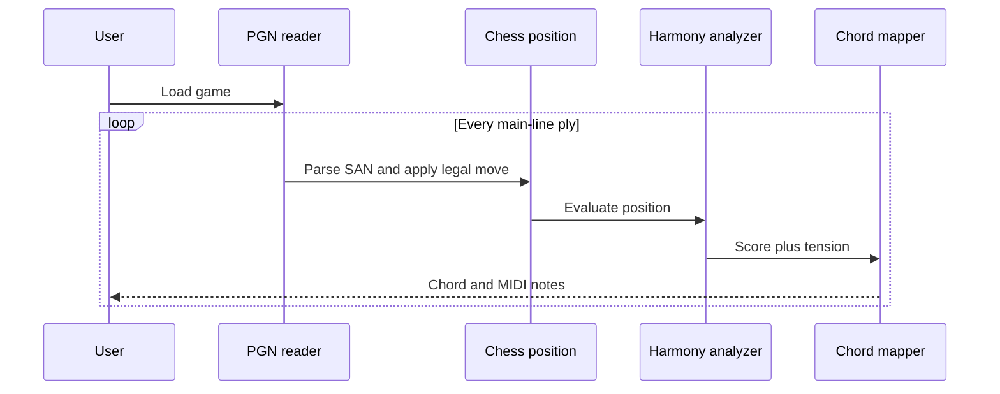

# Architecture

## Boundaries

### `PianoMan.Core.Chess`

Owns the board state, FEN, legal moves, SAN, and PGN. It has no knowledge of music
or evaluation weights.

### `PianoMan.Core.Harmony`

Turns a position into a `HarmonySnapshot`. `ChordMapper` is a separate final step,
so changing musical vocabulary cannot silently change chess decisions.

### `PianoMan.Core.Analysis`

Coordinates PGN replay and emits a timeline with the source move, resulting FEN,
harmony vector, chord symbol, and MIDI notes.

### `PianoMan.Cli`

Provides a small Native AOT entry point. It formats console output and JSON but
contains no chess rules.

## Data flow

## Performance path

The array board and full recomputation in v0.1 favor auditability. The intended
engine path is:

1. Establish correctness with perft tests.
2. Introduce twelve piece bitboards and occupancy masks.
3. Cache attack maps and piece relationships.
4. Update the harmony vector from the move delta.
5. Store positions by Zobrist hash.
6. Add a narrow resolution search triggered by harmonic shock.

Public types describe concepts rather than storage, so the board representation can
change without altering the analysis format.

## Dependency policy

Production projects use only the .NET base class library. This keeps publishing,
profiling, and Native AOT behavior predictable. Test frameworks remain test-only.
